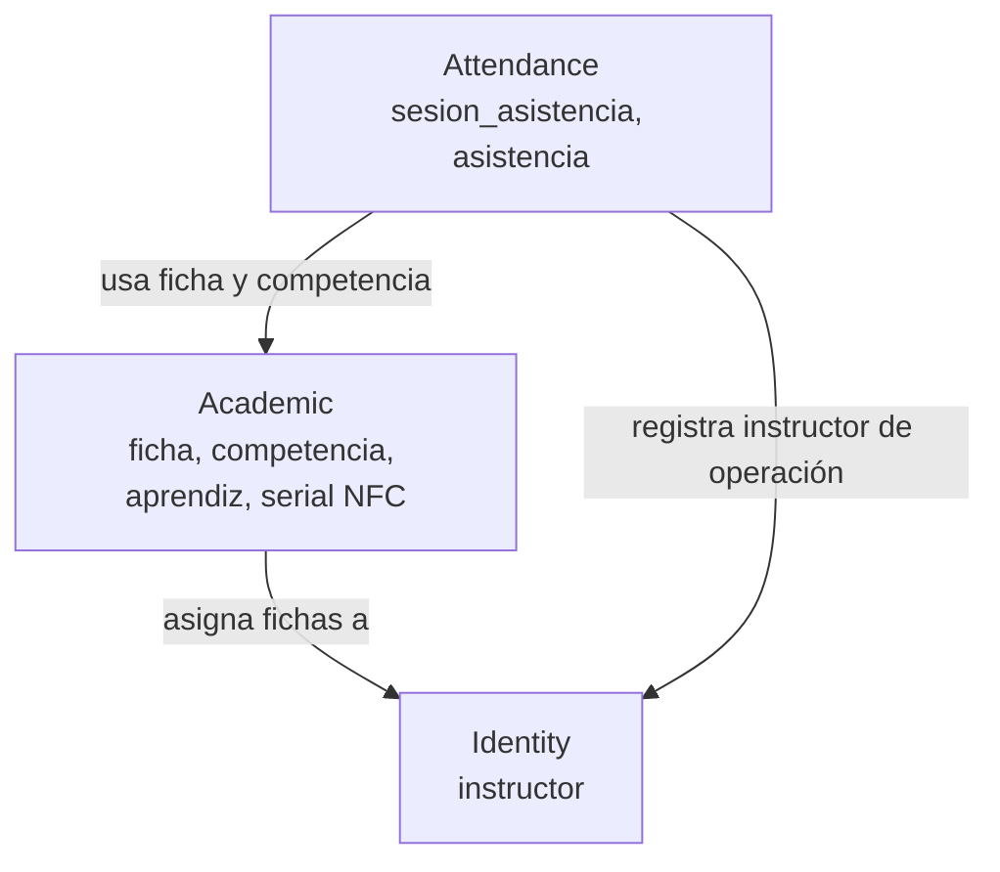

# Mapa de dominio

| Relación | Significado |
|---|---|
| Academic -> Identity | Una ficha puede tener instructor asignado |
| Attendance -> Academic | La sesión pertenece a una ficha y competencia; el aprendiz pertenece a la ficha |
| Attendance -> Identity | Una asistencia puede registrar el instructor que la opera |

Cada contexto se convierte en un módulo interno del mismo monolito, no en un servicio desplegable separado.
