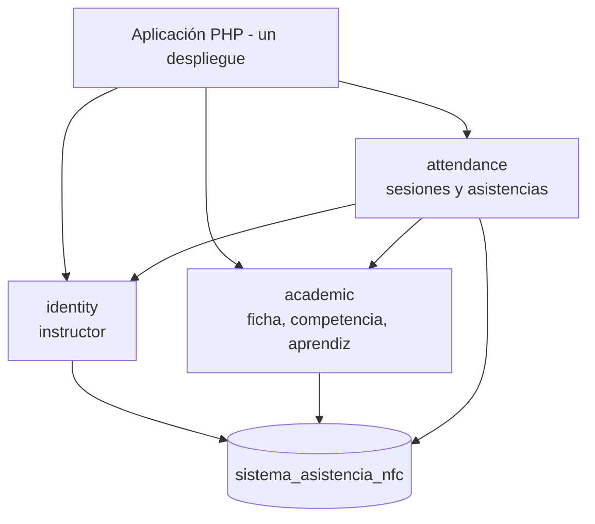

# Monolito modular

## Decisión

Se mantiene una sola aplicación PHP con una sola base de datos MariaDB. La separación interna se expresa mediante los módulos `identity`, `academic` y `attendance`.

Los módulos no son servicios independientes. Las llamadas son locales y se entregan mediante entradas PHP o APIs internas definidas por el proyecto.

Estado: la separación existe en el dominio y los endpoints; la estructura física completa por módulo es objetivo de evolución.
