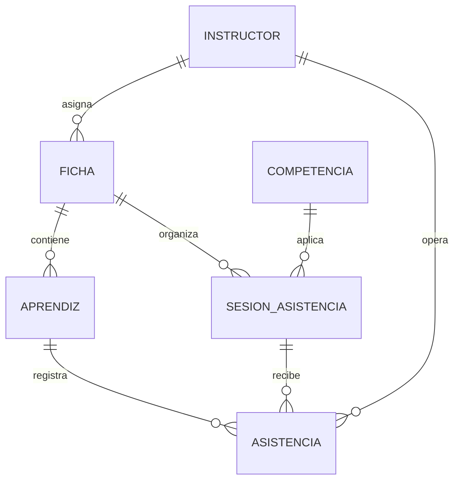

# Modelos y propietarios

| Entidad | Tabla | Propietario | Claves relevantes |
|---|---|---|---|
| Instructor | `instructor` | `identity` | `id_instructor`, usuario, correo |
| Ficha | `ficha` | `academic` | `id_ficha`, instructor asignado |
| Competencia | `competencia` | `academic` | `id_competencia`, código |
| Aprendiz | `aprendiz` | `academic` | `id_aprendiz`, identidad, `serial_nfc`, ficha |
| Sesión | `sesion_asistencia` | `attendance` | `id_sesion`, ficha, competencia, estado |
| Asistencia | `asistencia` | `attendance` | sesión, aprendiz, estado, método |

La restricción única `(id_sesion, id_aprendiz)` garantiza una asistencia por aprendiz y sesión.
